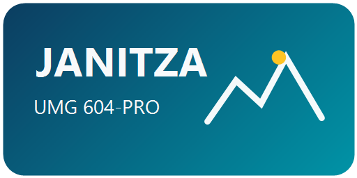

# Janitza UMG 604-PRO for Home Assistant

Home Assistant custom integration for the Janitza UMG 604-PRO power analyzer via Modbus TCP.

Lokale, alleen-lezen Home Assistant-integratie voor een Janitza UMG 604-PRO via Modbus TCP.
Deze integratie is bedoeld voor energiemeting, netkwaliteitsbewaking en langdurige logging in Home Assistant.

De integratie schrijft nooit naar de meter. Alle communicatie is alleen-lezen.

## Wat doet deze integratie?

Deze custom integration leest meetwaarden uit een Janitza UMG 604-PRO en maakt daarvan Home Assistant-sensoren.
Daarmee kun je in Home Assistant dashboards, grafieken, automatiseringen en energie-/netkwaliteitsbewaking maken.

Geschikt voor onder andere:

- Janitza UMG 604-PRO
- Modbus TCP
- HACS custom repository
- energieverbruik en teruglevering
- spanning, stroom en vermogen per fase
- power factor, cosinus phi, THD/TDD en onbalans
- apparaatinfo zoals serienummer, firmware en trafo-instellingen

## Functies

- Alleen-lezen Modbus TCP-communicatie
- Configuratie via de Home Assistant UI
- Instelbaar IP-adres, TCP-poort, Modbus unit-ID, uitleesinterval en register-offset
- Sensoren met duidelijke fase- en lijnreferenties, zoals `Spanning L1-N` en `Spanning L1-L2`
- Energiesensoren geschikt voor langdurige Home Assistant-statistieken
- Lokale Home Assistant brand assets (`icon.png` en `logo.png`) voor herkenning in HACS/Home Assistant
- Voorbeeld-dashboard voor Lovelace in `examples/lovelace-dashboard.yaml`

## Installatie via HACS

1. Open **HACS** in Home Assistant.
2. Ga naar **Integraties**.
3. Kies rechtsboven **Custom repositories**.
4. Vul deze repository-URL in:

   `https://github.com/Bsc1967/janitza-umg604-ha`

5. Kies categorie **Integration**.
6. Download **Janitza UMG 604-PRO**.
7. Herstart Home Assistant volledig.
8. Voeg de integratie toe via **Instellingen > Apparaten & diensten > Integratie toevoegen**.

## Handmatige installatie

1. Kopieer `custom_components/janitza_umg604` naar `config/custom_components/` van Home Assistant.
2. Herstart Home Assistant volledig.
3. Ga naar **Instellingen > Apparaten & diensten > Integratie toevoegen**.
4. Zoek naar **Janitza UMG 604-PRO**.
5. Vul IP-adres, poort, Modbus unit-ID, uitleesinterval en register-offset in.

Standaardwaarden:

- host: IP-adres van de meter, bijvoorbeeld `192.168.1.30`
- poort: `502`
- unit-ID: meestal `1`
- register-offset: meestal `0`

Gebruik register-offset `-1` alleen als jouw apparaat aantoonbaar één register verschoven antwoordt.

## Sensoren

De sensoren hebben expliciete fase- of lijnreferenties in de naam:

- `Spanning L1-N`
- `Spanning L2-N`
- `Spanning L3-N`
- `Spanning L1-L2`
- `Spanning L2-L3`
- `Spanning L3-L1`
- `Stroom L1`
- `Stroom L2`
- `Stroom L3`

Daarnaast levert de integratie onder andere:

- actief vermogen per fase
- totaal actief, reactief en schijnbaar vermogen
- power factor totaal, per fase en gemiddeld
- frequentie
- afgenomen en teruggeleverde energie
- schijnbare energie en blindenergie
- temperatuur
- spannings- en stroomonbalans
- fasevolgorde
- cosinus phi per fase
- THD spanning en stroom per fase
- TDD stroom per fase
- digitale ingangen
- gebeurtenis-, flag- en transienttellers
- serienummer, productienummer, apparaatnaam, omschrijving en firmware
- stroomtrafo- en spanningstrafo-instellingen per fase

De energietellers worden omgerekend van Wh naar kWh.

## Dashboard voorbeeld

In `examples/lovelace-dashboard.yaml` staat een voorbeeld-dashboard in de stijl van het eerdere lokale Janitza-dashboard.

Het dashboard bevat views voor:

- overzicht
- grafieken
- netkwaliteit
- apparaatinfo

Let op: Home Assistant kan entity IDs per installatie anders noemen. Controleer daarom altijd de entity IDs in jouw eigen Home Assistant-installatie.

## Power factor en cosinus phi

Power factor en cosinus phi zijn niet hetzelfde.

- **Power factor** gebruikt het werkelijke schijnbare vermogen en bevat daardoor ook invloed van harmonischen.
- **Cosinus phi** is de faseverschuiving van de grondgolf en wordt apart per fase getoond.

## Bestaande entiteitsnamen in Home Assistant

Als Home Assistant eerder al sensoren heeft aangemaakt met generieke namen zoals `Spanning`, kan Home Assistant die oude naam vasthouden in het entiteitenregister.

Na een update kun je dit oplossen door:

1. Home Assistant volledig te herstarten.
2. De Janitza-integratie opnieuw te laden.
3. Eventueel de betreffende entiteiten handmatig te hernoemen of de integratie opnieuw toe te voegen.

## Zoekwoorden

Home Assistant, HACS, Janitza, UMG 604-PRO, UMG604, Modbus TCP, energy monitoring, power quality, netkwaliteit, THD, TDD, power factor, cosinus phi.
